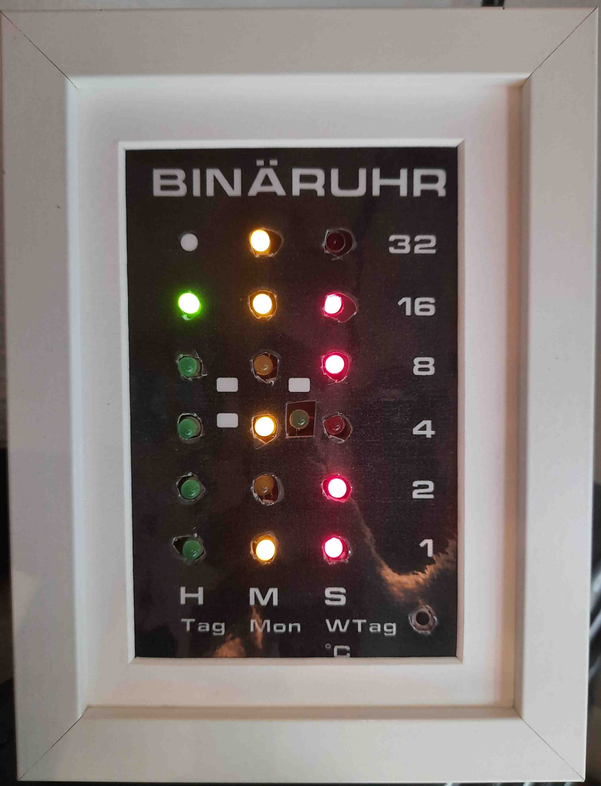
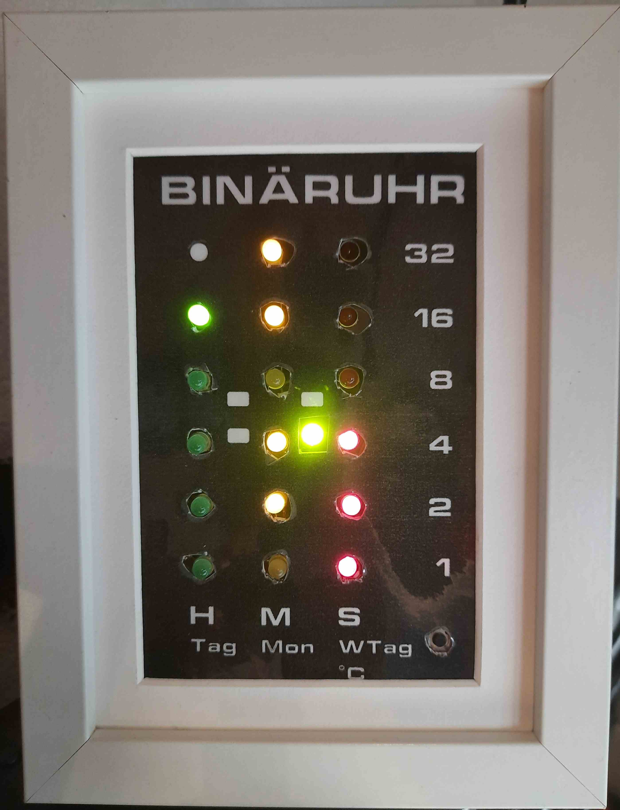
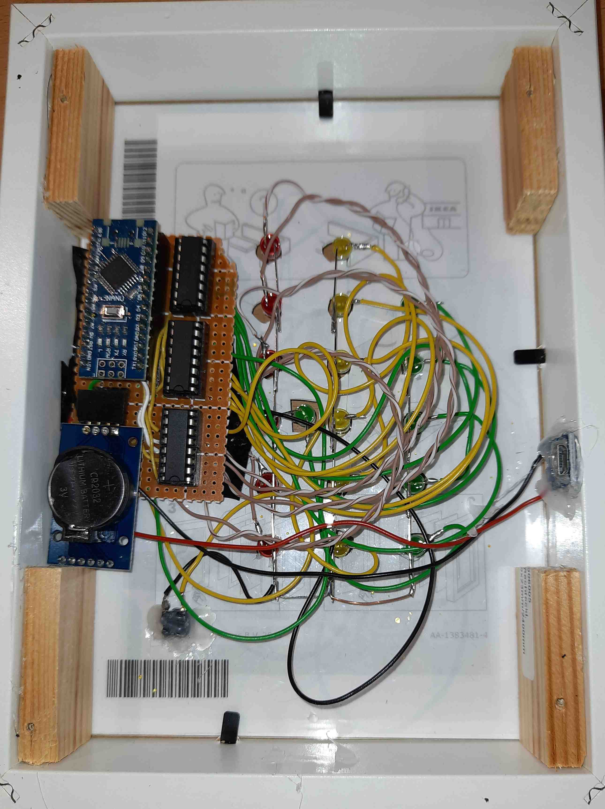
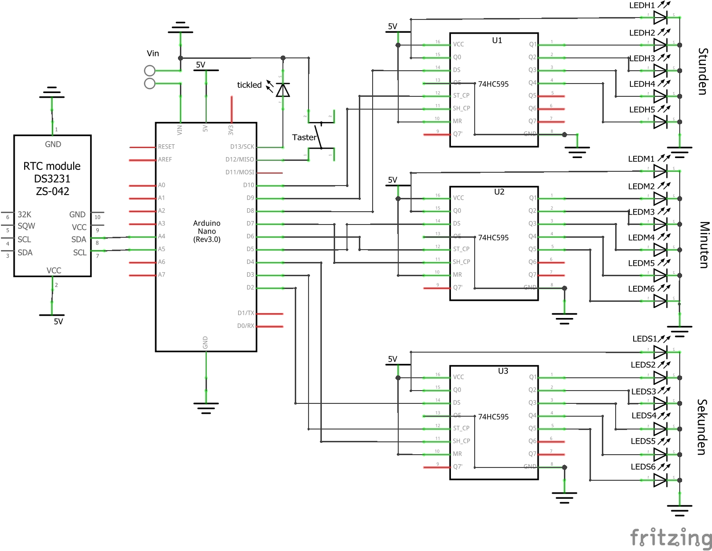
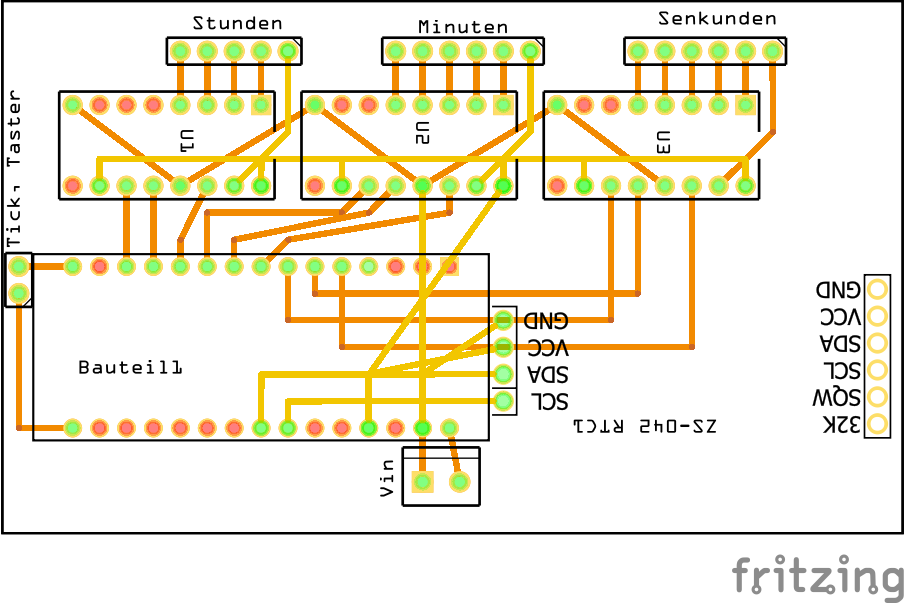
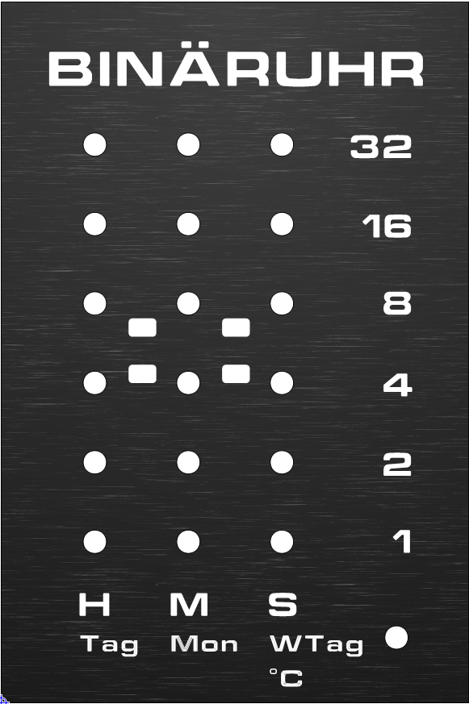

# Arduino Binäruhr 
Eine Binäruhr basierend auf einem Arduino Nano. Die LEDs werden mit Hilfe von 74HC595 Schieberegistern angesteuert.

## Features
- Einbau in einem IKEA Ribba Bilderrahmen 13x18 cm (bzw. 10x15 cm)
- Die Zeit wird von einer DS3231 RTC bereitgestellt
- Ein Taster zum ändern der Anzeige:
  - Normalmodus: Zeitanzeige - Stunden, Minuten, Sekunden
  - Datumsanzeige - Tag, Monat, Tag der Woche (1-7)
  - Temperaturanzeige - Temperaturmessung erfolgt durch das RTC-Modul 
    - Wenn die Anzeige im Datum- oder Temperaturmodus ist, wechselt sie nach 10 Sekunden automatisch zum Normalmodus zurück
- Eine extra LED blinkt 2 mal jede Sekunde

# Hardware
## Schaltplan
**Im Schaltplan sind keine Vorwiderstände für die einzelnen LEDs eingetragen, diese sollten jedoch verbaut werden! (Wert: 220R)**   

## Leiterplatte

## Frontplatte
Ich habe für den Bilderrahmen eine Frontplatte erstellt (Software: Frontplatten Designer, Schaeffer AG). Diese ist passend für den IKEA Bilderrahmen und kann im Format **10x15 cm** ausgeruckt werden. 
  

# Software
Der Code kann ohne weitere Änderungen verwendet werden. Um die Zeit des RTC-Moduls einzustellen müssen im Code die entsprechenden Zeilen auskommentiert und mit der aktuellen Uhrzeit gefüllt werden. Anschließend muss dieser Code **einmalig** auf dem Arduino ausgeführt werden.

Die Verwendete Bibiliothek für die DS3231 ist im Ordner des Programmes bereits hinterlegt und muss nicht extra heruntergeladen werden. Zusätzlich ist die Quelle der Bibiliothek jedoch im Code verlinkt.

# Quellen
- https://pascalstechtips.weebly.com/projekte/arduino-binruhr-v10 
- DS3231: http://www.rinkydinkelectronics.com/library.php?id=73
- Software für Frontplatte: https://www.schaeffer-ag.de/frontplatten-designer#

  

This work by Dustin Brunner is licensed under <a rel="license" href="https://creativecommons.org/licenses/by/4.0">CC BY 4.0</a>

 Dieses Werk von Dustin Brunner ist lizenziert unter einer <a rel="license" href="http://creativecommons.org/licenses/by/4.0/">Creative Commons Namensnennung 4.0 International Lizenz</a>.

